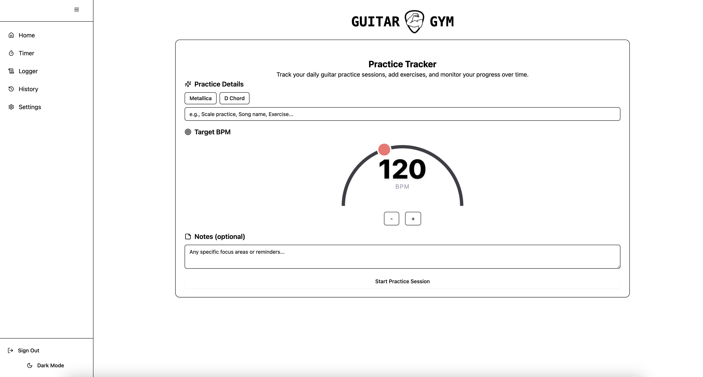
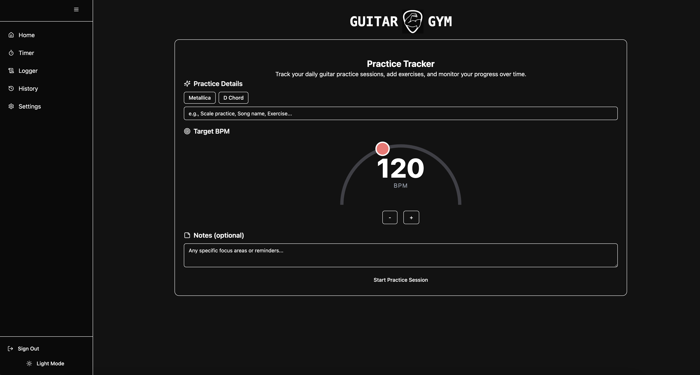

# 🎸 Guitar Practice Tracker

> Track, organize, and improve your guitar practice sessions. Built with **React + TypeScript + TailwindCSS**, with Firebase backend.

---

## 📸 Demo

👉 **[Try it live here](https://guitar-gym-tracker.netlify.app/)**

---

## 🚀 Features

- ⏱️ Log practice sessions (date, duration, exercises)
- 📊 View practice history
- 🔐 Authentication (Google login)
- ☁️ Cloud sync (Firebase / GCP)

---

## ⚙️ Tech Stack

- [Vite](https://vitejs.dev/) — Next-gen build tool
- [React](https://react.dev/) — Modern UI library
- [Tailwind CSS](https://tailwindcss.com/) — Utility-first styling
- [Firebase](https://firebase.google.com/) - Firebase
- [ESLint](https://eslint.org/) + [Prettier](https://prettier.io/) — Consistent code style

---

## 🖥️ Screenshots

| Light Mode                             | Dark Mode                            |
| -------------------------------------- | ------------------------------------ |
|  |  |

---

## 🚀 Getting Started

### 1️⃣ Clone the repo

```bash
git clone https://github.com/Chris-Z-85/guitar-gym-tracker.git
cd guitar-gym-tracker
```

### 2️⃣ Install dependencies

```bash
npm install
# or
pnpm install
```

### 3️⃣ Run locally

```bash
npm run dev
```

### 4️⃣ Build for production

```bash
npm run build
```

### 5️⃣ Preview production build

```bash
npm run preview
```

## ♿ Accessibility

Semantic HTML tags

Interactive elements have aria-labels

Icons with accessible descriptions or aria-hidden

Usable via keyboard

## 🗂️ TODO

Feel free to pick an open issue or submit your ideas!

## 🤝 Contributing

Contributions are welcome!

Fork the repo

Create a new branch (git checkout -b feature/my-feature)

Commit your changes

Push to your fork (git push origin feature/my-feature)

Open a Pull Request

See CONTRIBUTING.md for more details.

## 📃 License

This project is licensed under the MIT License — see LICENSE for details.

## 🙋‍♂️ Author

Chris Z
📧 chris.z@aol.com
🌐 https://chris-z.dev/
🐙 GitHub: Chris-Z-85

## ⭐️ Show Your Support

If you find this project helpful:

## ⭐️ Star this repo

🍴 Fork it

🗣️ Share it with fellow musicians!

## 📣 Feedback

Got feedback or feature requests?
Open an issue — I’d love to hear your ideas!
